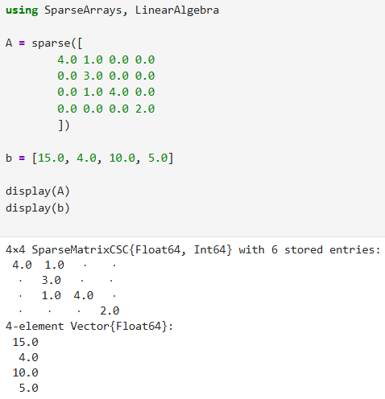
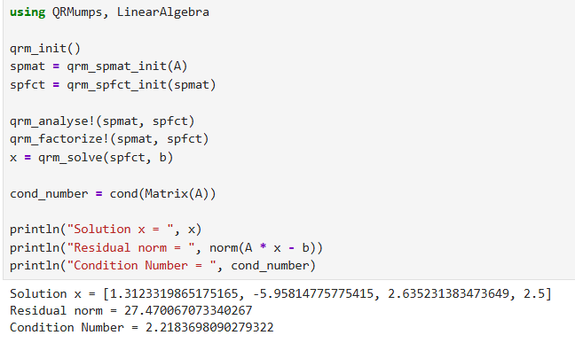

# **QRMumps.jl**

`QRMumps.jl` is a Julia package designed to solve large, sparse linear systems of equations (Ax=b)

### **Technology**

It acts as a wrapper for the QR\_MUMPS library, which uses a multifrontal QR factorization method. This method is known for its numerical stability, especially with ill-conditioned matrices.

### **Audience**

The software is targeted at computational scientists, engineers, and researchers using Julia for tasks that involve sparse matrices, such as numerical optimization.

**Repository:** [github.com/JuliaQR/QRMumps.jl](https://www.google.com/search?q=https://github.com/JuliaQR/QRMumps.jl)

**Age:** Started in 2017

**Community:** 6 lifetime contributors, with discussions on GitHub Issues

**Activity Level:** Mature and stable with a low commit frequency, which indicates a complete feature set rather than neglect.

## **Code Example**

### **Setup**

### **Solve**

## **Question:** How accurate are the estimates from the qrm\_analyse phase compared to the actual values from the qrm\_factorize phase? And how does this accuracy change based on the matrix's structure?

## **Proposed Experiment Steps:** 

1. Use a diverse set of sparse matrices, which SuiteSparse Matrix Collection can be used.  
2. For each matrix, run the qrm\_analyse step and log all the "estimate" parameters (qrm\_e\_facto\_flops, qrm\_e\_nnz\_r).  
3. Then, run the qrm\_factorize step and log all the corresponding "actual" parameters (qrm\_facto\_flops, qrm\_nnz\_r).  
4. Calculate the estimation error for each metric (Actual FLOPS / Estimated FLOPS).  
5. Plot these error ratios and see if you can find a pattern. Are the estimates better for matrices from "finite element methods" (structured) versus "graph" or "combinatorial" problems (unstructured)?
